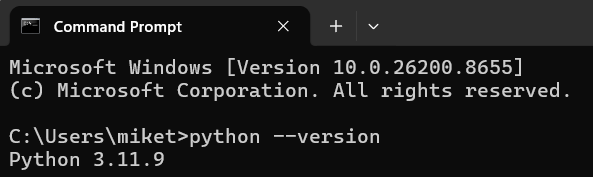
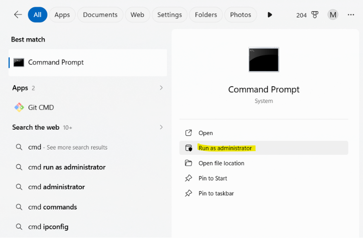

# Zwift Pre-ride Reminder

**v0.1-beta** · Windows only · Python required

A lightweight Zwift utility that pops up a reminder of things you'll need before a group ride or race! Eg water bottle, fan, towel and bike/wheel setup.

NOTE: Pop-up only shows if you are in the starting pen, and have at least 30s to flag-off


---

## Requirements

- **Windows 10 or 11**
- **Python 3.9 or later** — download from [python.org](https://www.python.org/downloads/)
- **Zwift running in Windowed mode only** — the pop-up currently does not work with Zwift in Fullscreen mode. To enable Windowed mode in Zwift: Settings > Audio & Video > Screen Mode > Windowed


---


## Disclaimer

This project is independent and not affiliated with, endorsed by, or approved by Zwift Inc. in any way. Zwift is a trademark of Zwift Inc. This tool works by reading a log file that Zwift writes to disk and does not modify, patch, or interact with Zwift or its servers in any way. Use it at your own discretion.


---

## Installation

**1. Check Python is installed**

Open a command prompt (type "cmd" in the Window search bar), then run:
```
python --version
```



You should see something like `Python 3.11.9`. If you get an error, or a version below 3.9, download and install Python from [python.org](https://www.python.org/downloads/) before continuing.

> **Important:** During installation, tick **"Add Python to PATH"** — this option is unticked by default and is required for everything below to work.


**2. Download the project**

Click the green **Code** button on this page → **Download ZIP**, then extract it somewhere permanent (e.g. `C:\Users\YourName\Projects\zwift-reminder`).

Or if you have Git:
```
git clone https://github.com/miketee/zwift-reminder.git
```

**3. Install Python dependencies**

Open a command prompt and run:
```
pip install psutil
```


**4. Register the background task**

From the project folder, run:
```
python setup_task.py
```

You should see:
```
Success: scheduled task 'ZwiftPenReminderWatchdog' created.
```

If you see `Access is denied`, open a command prompt as Administrator (right-click → Run as administrator), navigate to the project folder, and run the command again. This is a one-time step — the task runs as a normal user from then on.




**5. Start it immediately** *(without restarting)*

```
schtasks /Run /TN "ZwiftPenReminderWatchdog"
```

From this point on, the watchdog starts automatically every time you log into Windows. No further action needed.

**6. Test it**

To confirm the popup works before your next ride:
```
python src\popup.py
```

This shows the popup immediately using your current `config.json` settings.

---

## Uninstalling

To remove the background task:
```
python setup_task.py --uninstall
```

Then delete the project folder.

---

## What this does NOT do

- **Does not work in Fullscreen mode.** Windowed screen is required. See Requirements above.
- **Does not work if Zwift was already running when you started your PC.** The watchdog starts on login; if Zwift was somehow already open at that point, it may miss the first detection cycle.
- **Does not fire if you were already in the pen when Zwift launched.** The log watcher starts from the current position in `Log.txt` — it doesn't scan backwards. If you were already sitting in a pen when Zwift started, that reminder is missed. The next event will be caught normally.
- **Does not support macOS or Linux.** For now, this tool is Windows-specific.
- **Does not modify Zwift or interact with it in any way.** It only reads Zwift's own log file (`Log.txt`), which Zwift writes itself. The Zwift process is never touched.
- **Log format is undocumented.** Zwift doesn't publish the format of `Log.txt`. If Zwift changes it in a future update, detection may stop working until this tool is updated to match.

---

## Troubleshooting / Q&A


**Can I customize the pop-up content?**

Yes you can! Open `config.json` in Notepad and edit it to your liking:
```json
{
    "popup_title": "Pre-ride Checklist",
    "popup_subtitle": "Don't forget these!",
    "checklist": [
        "Water",
        "Fan",
        "Towel",
        "Bike Frame & Wheels!"
    ],
    "reminder_threshold_seconds": 35,
    "popup_auto_close_seconds": 15,
    "log_path": ""
}
```

`reminder_threshold_seconds` controls how close to the event start time the popup will still show. If you join a pen with less than 35 seconds to go, the popup is skipped (there's no time anyway). `popup_auto_close_seconds` controls how long the popup stays on screen before auto-dismissing.

**Popup doesn't appear**

Check `watcher_runtime.log` in the project folder. If it contains `JOINED_EVENT detected` but no popup appeared, check `popup_errors.log` for errors.

If `watcher_runtime.log` doesn't exist or is empty, check `watchdog_runtime.log` — if it doesn't show `Zwift detected running`, the watchdog may not be running. Run `schtasks /Run /TN "ZwiftPenReminderWatchdog"` to start it manually.

**Popup appears but steals focus from Zwift**

Make sure Zwift is in Windowed mode, not Fullscreen.

**`pip install psutil` fails**

Try:
```
pip install psutil --break-system-packages
```

Or install using the full Python path:
```
C:\Users\YourName\AppData\Local\Programs\Python\Python311\python.exe -m pip install psutil
```

**`python --version` opens the Microsoft Store instead of showing a version**

Windows sometimes intercepts the `python` command and redirects to the Store. This means Python isn't installed properly. Download it from [python.org](https://www.python.org/downloads/) directly, making sure to tick **"Add Python to PATH"** during installation.

---

## Feedback

This is a v0.1 beta. Expect bugs. If you try it, feedback is genuinely useful. Write to cathouseprojects@gmail.com

**Please open a GitHub Issue if:**
- The popup doesn't appear when you join a pen
- The popup appears at the wrong time
- You encounter an error or crash
- You're on a non-standard Zwift install and the log path isn't found

When reporting an issue, please attach your `watcher_runtime.log` and `watchdog_runtime.log` files — they contain the information needed to diagnose what happened.


---


