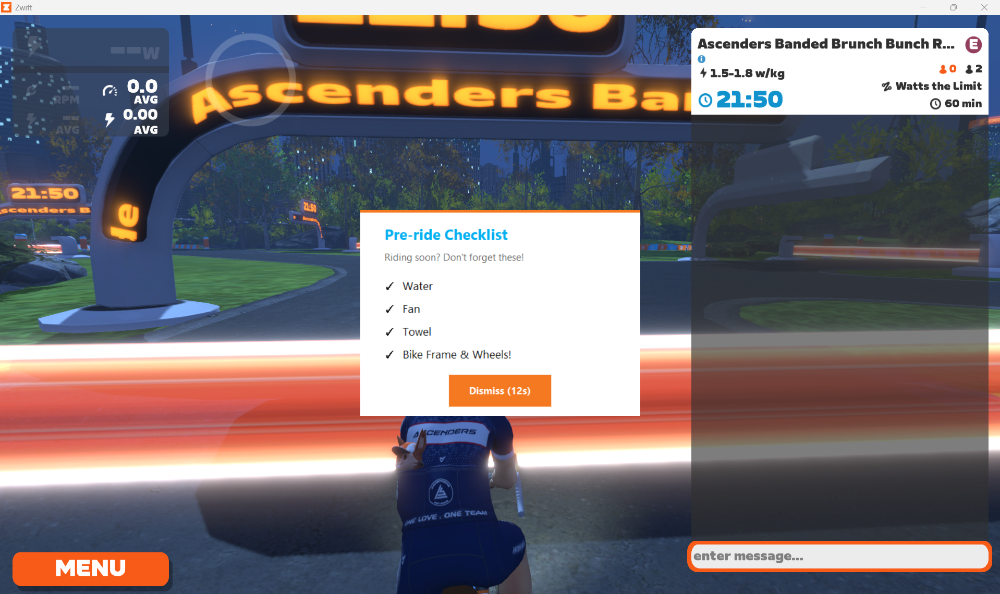
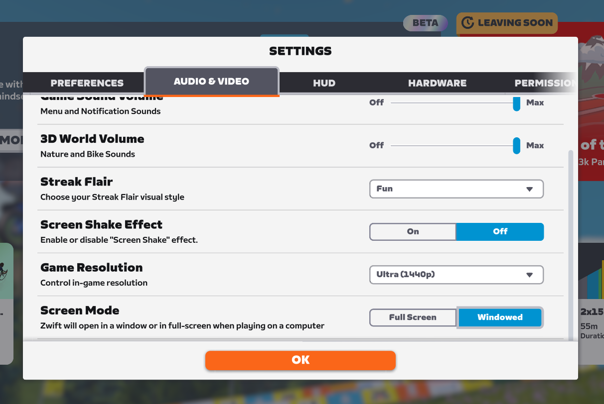

# Zwift Pen Reminder

**v0.1-beta** · Windows only · Python required

A lightweight background utility that watches for when you join a Zwift event pen and shows a pre-ride checklist popup — so you never roll into a race having forgotten your water bottle, fan, or the right bike frame.



---

## What it does

When you join an event pen in Zwift, a popup appears in the centre of your screen with a checklist of things to sort before the race starts. It auto-dismisses after 10 seconds (configurable) and never steals keyboard focus from the game — your power-ups and steering inputs go to Zwift, not this tool.

Once installed, it runs silently in the background every time you log into Windows. You don't need to launch or manage anything.

**The popup looks like this:**

- Header: "Pre-ride Checklist" (customisable)
- Subtitle: "Don't forget these!" (customisable)
- Your checklist items (fully customisable in `config.json`)
- A countdown Dismiss button

---

## Requirements

- **Windows 10 or 11**
- **Python 3.9 or later** — download from [python.org](https://www.python.org/downloads/)
- **Zwift running in Borderless Window mode** — the popup cannot appear over Zwift in exclusive fullscreen mode (this is a Windows limitation, not specific to this tool). To enable Borderless Window in Zwift: Settings → Graphics → Display Mode → Borderless Window




---

## Installation

**1. Download the project**

Click the green **Code** button on this page → **Download ZIP**, then extract it somewhere permanent (e.g. `C:\Users\YourName\Projects\zwift-reminder`).

Or if you have Git:
```
git clone https://github.com/miketee/zwift-reminder.git
```

**2. Install Python dependencies**

Open a command prompt and run:
```
pip install psutil
```

**3. Customise your checklist** *(optional but recommended)*

Open `config.json` in Notepad and edit it to your liking:
```json
{
    "popup_title": "Pre-ride Checklist",
    "popup_subtitle": "Don't forget these!",
    "checklist": [
        "Water",
        "Fan",
        "Towel",
        "Bike Frame & Wheels!"
    ],
    "reminder_threshold_seconds": 30,
    "popup_auto_close_seconds": 10,
    "log_path": ""
}
```

`reminder_threshold_seconds` controls how close to the event start time the popup will still show. If you join a pen with less than 30 seconds to go, the popup is skipped (you're already rolling). `popup_auto_close_seconds` controls how long the popup stays on screen before auto-dismissing.

**4. Register the background task**

From the project folder, run:
```
python setup_task.py
```

You should see:
```
Success: scheduled task 'ZwiftPenReminderWatchdog' created.
```

If you see `Access is denied`, open a command prompt as Administrator (right-click → Run as administrator), navigate to the project folder, and run the command again. This is a one-time step — the task runs as a normal user from then on.

**5. Start it immediately** *(without restarting)*

```
schtasks /Run /TN "ZwiftPenReminderWatchdog"
```

From this point on, the watchdog starts automatically every time you log into Windows. No further action needed.

**6. Test it**

To confirm the popup works before your next ride:
```
python src\popup.py
```

This shows the popup immediately using your current `config.json` settings.

---

## Uninstalling

To remove the background task:
```
python setup_task.py --uninstall
```

Then delete the project folder.

---

## What this does NOT do

- **Does not work in exclusive fullscreen mode.** Borderless Window is required. See Requirements above.
- **Does not catch the pen if Zwift was already running when you started your PC.** The watchdog starts on login; if Zwift was somehow already open at that point, it may miss the first detection cycle (recovers within 7 seconds).
- **Does not fire if you were already in the pen when Zwift launched.** The log watcher starts from the current position in `Log.txt` — it doesn't scan backwards. If you were already sitting in a pen when Zwift started, that reminder is missed. The next event will be caught normally.
- **Does not support macOS or Linux.** Zwift's log path and the no-focus-steal window trick are Windows-specific.
- **Does not modify Zwift or interact with it in any way.** It only reads Zwift's own log file (`Log.txt`), which Zwift writes itself. The Zwift process is never touched.
- **Log format is undocumented.** Zwift doesn't publish the format of `Log.txt`. If Zwift changes it in a future update, detection may stop working until this tool is updated to match.
- **Only tested on Group Rides** so far. Race pens are expected to behave the same but have not been confirmed.

---

## Troubleshooting

**Popup doesn't appear**

Check `watcher_runtime.log` in the project folder. If it contains `JOINED_EVENT detected` but no popup appeared, check `popup_errors.log` for errors.

If `watcher_runtime.log` doesn't exist or is empty, check `watchdog_runtime.log` — if it doesn't show `Zwift detected running`, the watchdog may not be running. Run `schtasks /Run /TN "ZwiftPenReminderWatchdog"` to start it manually.

**Popup appears but steals focus from Zwift**

Make sure Zwift is in Borderless Window mode, not exclusive fullscreen.

**`pip install psutil` fails**

Try:
```
pip install psutil --break-system-packages
```

Or install using the full Python path:
```
C:\Users\YourName\AppData\Local\Programs\Python\Python311\python.exe -m pip install psutil
```

---

## Feedback

This is a v0.1 beta — it works, but it's only been tested by one person on Group Rides. If you try it, feedback is genuinely useful.

**Please open a GitHub Issue if:**
- The popup doesn't appear when you join a pen
- The popup appears at the wrong time
- You encounter an error or crash
- You're on a non-standard Zwift install and the log path isn't found

When reporting an issue, please attach your `watcher_runtime.log` and `watchdog_runtime.log` files — they contain the information needed to diagnose what happened.

**Pull requests welcome**, especially for:
- Race pen testing and confirmation
- macOS/Linux support
- Anything in the "What this does NOT do" list above

---

## How it works (technical)

The watchdog (`watchdog.py`) runs at login and polls the Windows process list every 7 seconds. When it detects `Zwift.exe` or `ZwiftLauncher.exe`, it starts the log watcher (`watcher.py`). The watcher tails Zwift's `Log.txt` in real time, looking for the `JOINED_EVENT` marker followed by an `event start=` timestamp. When a pen join is detected, it spawns the popup (`popup.py`) as a separate process using `pythonw.exe`, with Win32 `WS_EX_NOACTIVATE` and `WS_EX_TOPMOST` styles applied so it renders above Zwift without ever stealing keyboard focus.

Log files (`watchdog_runtime.log`, `watcher_runtime.log`) are capped at 200KB and self-rotate by trimming the oldest half when the limit is reached.
